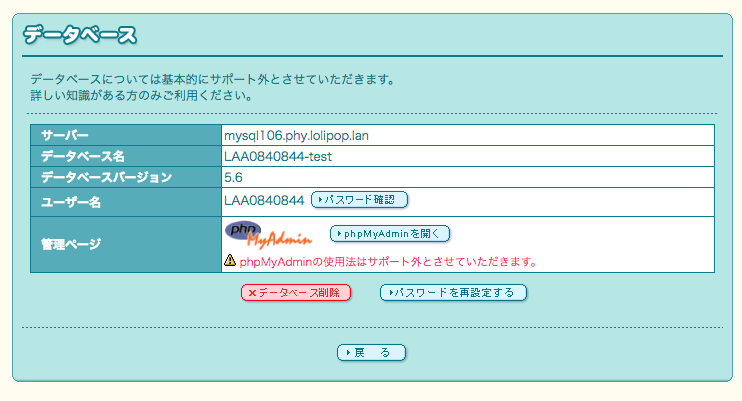

# ロリポップ！レンタルサーバーへ移行する
## 移行準備
### ロリポップ！レンタルサーバーのアカウント登録
アカウントをお持ちでない方は[ロリポップ！レンタルサーバー](https://lolipop.jp/) からお申込みをお願いします。
「ライトプラン」「スタンダードプラン」「エンタープライズプラン」のいずれかをご契約ください。

### データベースのバックアップ
[アプリケーションの復元方法（バックアップとリストア）](https://sqale.jp/support/manual/db-backup-restore)を参考にデータベースのバックアップをおこなって下さい。

## データベース作成
ロリポップ！ユーザー専用ページの[データベース](https://user.lolipop.jp/?mode=mysql)のページ内でデータベースを作成します。

「データベース作成」ボタンを押して下さい。

データベース名と接続パスワードを入力して、「作成」ボタンを押して下さい。

データベース一覧にデータベースが追加されていることを確認出来たらデータベースの作成は完了です。

## phpMyAdminでデータベース移行
[データベース](https://user.lolipop.jp/?mode=mysql)のページ内のデータベース一覧から「操作する」ボタンを押すと以下の画面が表示されます。

「phpMyAdminを開く」ボタンを押すとphpMyAdminのログインページに切り替わります。
データベースのユーザー名・パスワードを入力して、サーバーを選択をした後に「実行」ボタンを押すとphpMyAdminへログインすることが出来ます。
ログインした後画面左側の表示されているデータベース名を選択して下さい。

画面上部の「インポート」をクリックすると以下のような画面が表示されるので、
データベースのバックファイルをアップロードするファイルとして選択して下さい。

「実行」ボタンを押してファイルをアップロードします。
「インポートは正常終了しました。」と画面に表示されたらデータベースの移行は完了です。

## ファイルのアップロード
[「各種FTPソフト」](https://lolipop.jp/manual/hp/ftp-set/)または[「ロリポップ！FTP」](https://lolipop.jp/manual/user/ftp2-01/)を使用して、
必要なファイルのアップロードをおこなって下さい。サーバー情報は[アカウント情報/パスワード変更ページ](https://user.lolipop.jp/?mode=account)に記載されています。

## アプリケーションの表示確認
ロリポップ！にファイルをアップロードした後、ロリポップ！のドメインまたは独自ドメインでWebサイトが表示できたら移行は完了です。
これまで「Sqale」をご利用いただき、誠にありがとうございました。
